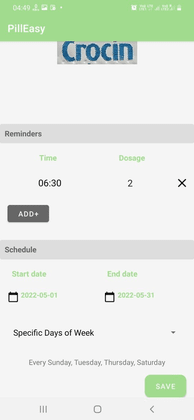
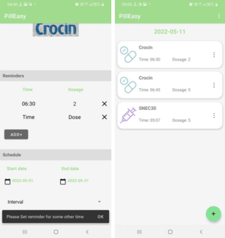
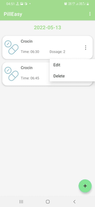
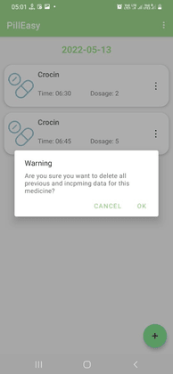
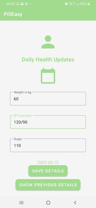
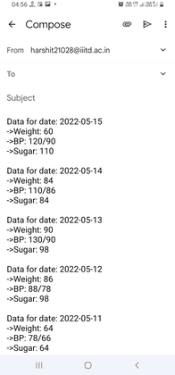
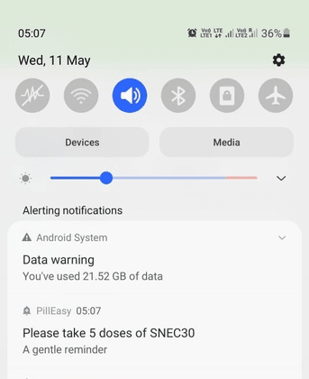

# PillEasy

## Motivation

The motivation to build this product came from observing the elderly people in the family having to suffer through the stress of missing out on pills in the absence of regular supervision. Many times hospitals also display a lack of supervision. People sometimes take incorrect medicines due to lack of information or misjudgment. Neither do they have a proper listing of the medication they are taking and when to consume them. All these happenings motivated us to develop an easy solution for the aged and the ailing.

## Problem Statment

There are times when people miss their medicines due to busy schedules, or maybe they fail to remember those. We are developing an app that keeps track of the time when a person needs to have medicine and alerts him/her regarding the same, along with other add-on features like they can track the blood pressure(systolic/diastolic), sugar and weight, and can share the report via email. Users can also click photos of the medicine strips and prescription images and save them in local storage.

## Related Work

There are many apps in this domain, and the main players are MyTherapy Pill Reminder, Medisafe Pill Reminder, and Medication Tracker; both of them have more than ten lakhs + downloads. None of the available apps has used the feature of Computer Vision which retrieves medicine names using the images of the medicine strips given as input by the user.

## Features Implemented
 

 Application Logo 

- Welcome Walkthrough Screen:
  - This page aims to welcome new users and get them excited to take that next step on their way to loving your product. The Welcome pages are even more crucial as the First-time user experiences significantly affect long-term revenue.
  
    
    
     

- Register and Login

  
  
  
  
   

- Add a Reminder

- Extract the name of the medicine from the image of the medicine strips (Using Computer Vision).
- Highlight the category of medicine (as Pill/ Spray/ Injection/Capsule/ Inhaler etc.)
- Add multiple reminders, i.e., if the medicine is taken twice or thrice a day.
- The Medicine doses, along with starting and ending date, can be set.
- Schedule the medicines from some particular day to the other along with intervals of specific days of the week:
  - If some medicine is to be taken only for, say, seven continuous days, then we can add it from a particular date to its end date.
  - Or, if any medicine is taken once a week, that can also be added concerning days of the week.
  - Also, if some medicine is to be taken after any or any alternate days.

    
    
    
    
    
     

- The Medicines can be added or deleted by the user.

- Rescheduling of Medicine (Edit Medicines)

  
  
   

- Keep track of the daily Weight, BP, and Sugar of the Patient using forms and displaying them datewise:
  - To update details, a form is attached that takes the values of different health parameters and the current date and stores it in the SQLite Database. The data is stored in the device in the form of RecyclerView, making it easy to see the previous day's health fluctuations.
  - The user can send the custom report of regular Health updates via email.
    
    
    
    
    
    
     

- The Graph for the health details is plotted to show day-to-day fluctuation in Weight, Blood-Pressure, and Sugar values.
  - We have used “Any Chart Library” to plot the graph of Weight, Blood Pressure(systolic/diastolic), and Sugar. The user enters their information in the form prescribed, and the chart is plotted to take the date as the x-axis and blood pressure(systolic/diastolic), weight, and sugar on the y-axis.

    
     

- Add and save images of Prescriptions: The user had the advantage of preserving all their Prescriptions in one place in the application, along with the doctor’s name.

  
  
   

- There is a pop-up notification with the reminder at the set time of taking medicine by the user.
  
  
  
   

## Tools & Technology

1. Android Studio
2. SQLite Database
3. Android Programming using Java
4. Google Material Design
5. Any Chart Library
6. Optical Character Recognition

## Challenges Faced

- Several libraries are supported by only a few particular android versions, like the camera feature, which works for Android versions lower than 10.
- PDF generation for daily health details was not possible due to issues with storage and saving issues with Android versions.

## Future Work

- One future work can be to add doctors who can interact with patients and keep track of them.
- Another exciting field can be to add an e-commerce website where patients can shop for medicine.
- Lab pathology can also be added where users can take the medical test described by doctors at one door.
- We can also use printed prescriptions to fill all medicines the patient has to take at what time and interval in the future.

## References

1) [https://developer.android.com/docs](https://developer.android.com/docs)
2) [https://material.io/design](https://material.io/design)
3) [https://www.sqlite.org/docs.html](https://www.sqlite.org/docs.html)
4) [https://cloud.google.com/vision/docs/ocr](https://cloud.google.com/vision/docs/ocr)

## Project Team Members
Harshit Gupta (MT21028), Mohnish Basarkar (MT21052), Madiha Tariq (MT21125), Niharika (MT21132), Shrey Rastogi (MT21145)

